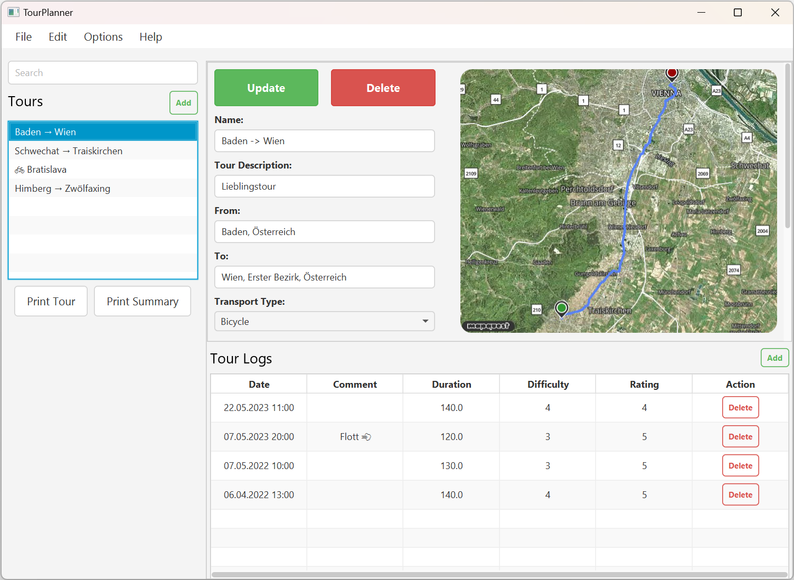

# Intro

This is a project for the course "Software Engineering" at my university.
Tourplanner is a JavaFx application that allows users to plan their trips (e.g. bicycle tours) and share them with others.
It makes use of modern architectural patterns and technologies.

It is constructed in an MVVM pattern and uses Hibernate to persist user data to a PostgreSQL database. It communicates
with the [MapQuest REST API](https://www.mapquest.com/]) to retrieve map data and the actual map image. As for the
styling of UI components a bootstrap port for JavaFx is used.



# Setup

The project contains a docker-compose file that starts a PostgreSQL database.

```bash
# Start the container
docker-compose up -d

# Create the db mtcg
docker exec <CONTAINER-ID> createdb -U josip tourplanner
```

Create a `config.properties` file in the root directory and add your MapQuest api key:

```bash
api_key=YOUR_API_KEY
```

Now you can launch the application in your IDE.

# Protocol

### Architecture

The concrete pattern I used is the MVVM pattern.


The View is the UI Layer (contained within the [ui folder](src/main/java/com/example/tourplanner/ui)), the ViewModel is
the BL (contained within the [viewmodel folder](src/main/java/com/example/tourplanner/viewmodel)), and the Model is the
DAL (contained within the [data/repository folder](src/main/java/com/example/tourplanner/data)).

The View makes use of data binding to bind the UI elements to the ViewModel. The ViewModel only works with
abstractions of repositories. The concrete implementation of a repository is injected into the ViewModel at startup.
This makes it easy to switch out the concrete implementation of the repositories and makes mocking repositories super
easy.
Each Layer only ever calls the Layer below it. The View only ever calls the ViewModel, the ViewModel only ever calls the
respective repository.

#### Library decisions

* JPA with Hibernate as the OR-Mapper. Implementing a full-blown Spring Server within the JavaFX application seemed a
  bit excessive.
* Mockito for mocking the dependencies of ViewModels in unit tests.
* Jackson is used for JSON serialization and deserialization
* Database engine used: PostgreSQL
* Logging framework used: log4j
* CSS framework used: BootstrapFX (the port is a bit outdated, but it looks decent enough)
* Report-generation library used: <>

### Use case

TODO Cade

### UX

TODO Cade:

• document your application features using an UML use case diagram
• document your UI-flow using wireframes
• document the application architecture using UML:
o class diagram
o sequence diagram for full-text search
• explain why these unit tests are chosen and why the tested code is critical

### Lessons learned

I consider this project a fine example of a clean MVVM architecture. The low coupling really made itself noticeable when
I created the Unit Test.

### Design patterns

Some of the patterns I used:

* MVVM
* Repository pattern
* Singleton pattern
* Factory pattern
* Dependency injection
* Observer pattern
* Interface pattern

### Unit testing decisions

Since the ViewModels contain the main Business Logic of the application, I created a separate unit test class for each
ViewModel.
I also created a test for the `MainViewModel` that takes care of the wiring between the separate ViewModels.
Let's suppose the user imports a tour from a file. This logic takes place in `MenuViewModel`. After the import is
done, we want to see those new tours in the list of available tours. However, `ToursViewModel` is responsible for that
list and `ToursViewModel` and `MenuViewModel` are completely unaware of each other (decoupled). This is where
the `MainViewModel` comes into play.

`MenuViewModel` exposes a callback that is called when the import is done. `MainViewModel` has a reference to every
single ViewModel and can therefore call the respective method on `ToursViewModel`.

```java
// MenuViewModel -> ToursViewModel
menuViewModel.setOnImported(toursViewModel::load);
```

Let's take a look at the unit test for this scenario. We want to test that the `load()` method of `ToursViewModel` is
called when the import is done.

The `MenuViewModel` was created with mocked instances of the repositories. This is done by using the `@Mock` annotation.

```java
@Mock
private MassDataRepository<Tour> tourRepository;
@Mock
private FileRepository<Tour> fileRepository;

@BeforeEach
public void setUp(){
        ...
        this.menuViewModel=Mockito.spy(new MenuViewModel(tourRepository,fileRepository));
}
```

Finally, the respective test looks like this. Note that we are also using a spy on the `ToursViewModel` to verify that
the `load()` method was called.

```java
@Test
public void testOnImported(){
        menuViewModel.performImport("",tours->{},null);

        verify(toursViewModel).load();
}
```

### Unique features

The user can decide the map type he wants to use (satellite, light, etc.). When he switches between the map types the
application tries to display the chosen map type without immediately downloading it. This is achieved by caching all
downloaded map images.
Furthermore, the application is pretty ^^

### Tracked time & git

I spent roughly 80 hours on [this project](https://github.com/JosipDomazetDev/TourPlanner).

